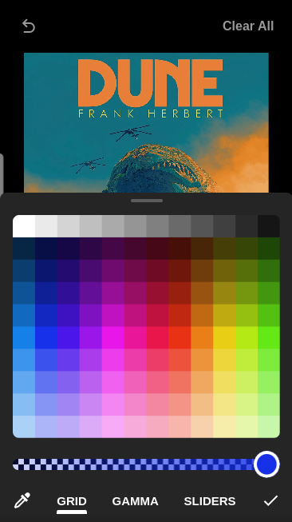

# 🎨 Telegram Image Editor

- [About](#about)
- [Features](#features)
- [Demo](#demo)
- [How to run](#how-to-run)
- [Screenshots](#screenshots)
- [License](#license)

## About
I've been using Telegram almost daily since I was introduced to it around early 2021. Never ever in my life I've seen an app with such level of polish and care put onto it.

In my four years using this app (writing this in 2025) my favorite part of it and by far is the image editor, it's so beatutifuly designed for all the awesome features it contains.

I've always dreamed of replicating it's functionaties and unveiling its secrets, I'm very excited to build this project as I've managed to learn a lot of different topics just by observing the app! Every UI component, gesture and animation have been created from scratch.

## Features
- Free hand drawing
    - 6 different pencils: basic, basic-arrow, highlight, magic wand, blur and eraser.
    - 3 configurable shapes: circle, star and arrow
- Color pickers
    - Grid
    - Gamma (Now they call it spectrum)
    - RGB sliders
    - Eyedropper
- Stickers
    - Image stickers
    - Text stickers (Checking feature vialiabity)
- Export image
    - copy as base64
    - download image (Web only)
    - save to device gallery (Android and iOS only)

## Demo
Pending

## How to run
Before running this project, follow [Watchman's installation guide](https://facebook.github.io/watchman/docs/install#buildinstall).

This project can be executed both as a web application and mobile application.

### Web
To execute this project as a web application run:
```sh
npx expo start --web --clear
```

### Android and iOS
This project is built with supported libraries by the Expo SDK only, so you can run this on your device no problem within the Expo GO app.

To execute this project as a mobile application run:
```sh
npx expo start --clear
```

## License
[Creative Commons BY-NC-SA 4.0](https://creativecommons.org/licenses/by-nc-sa/4.0/)

## Screenshots
[]("")





